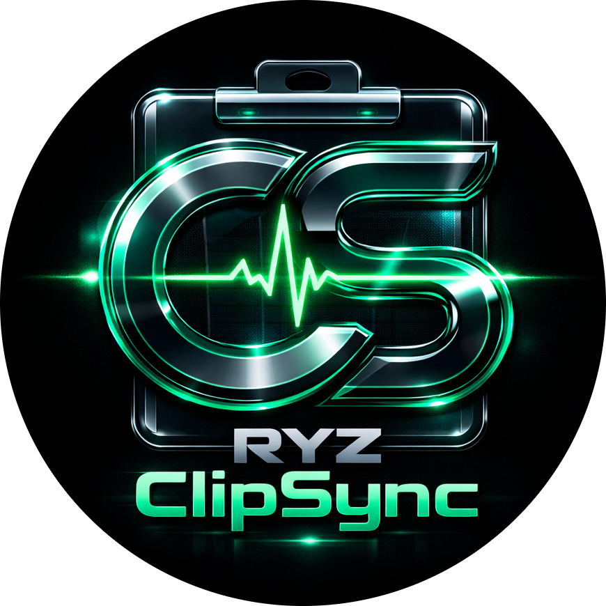

<div align="center">



# ⚡ RYZ ClipSync ⚡

### **Ultra-Fast Cyber Clipboard & Image Manager for Windows**

*Your complete text & image clipboard history — beautifully organized, instantly searchable, and lightning-fast.*

<br/>

[](https://github.com/riyazalsodie/RYZ-ClipSync/releases/tag/v1.1.0)
[](https://github.com/riyazalsodie/RYZ-ClipSync/releases/tag/v1.1.0)
[](https://github.com/riyazalsodie/RYZ-ClipSync)
[](LICENSE)

<br/>

[📥 **Download Latest Setup (v1.1.0)**](https://github.com/riyazalsodie/RYZ-ClipSync/releases/download/v1.1.0/RYZ.ClipSync.Setup.1.1.0.exe) • [✨ **Features**](#-features) • [🚀 **Quick Start**](#-quick-start) • [📑 **Pagination & Performance**](#-performance--architecture) • [⌨️ **Shortcuts**](#-keyboard-shortcuts) • [📬 **Support**](#-support)

<br/>

---

</div>

## 🌟 Overview

**RYZ ClipSync** is an elite, high-performance clipboard management system engineered specifically for Windows. Featuring an ultra-modern **OLED Black + Neon Green Cyberpunk aesthetic**, ClipSync monitors your clipboard seamlessly in the background — instantly storing up to **10,000 text clips and high-resolution screenshots**.

Equipped with **smart pagination controls**, **lazy loading**, and an **acrylic system tray window**, ClipSync runs with a near-zero memory footprint and zero interface lag.

<br/>

---

## ✨ Features

<div align="center">

| 🖼️ Media & Clip Engine | ⚡ Performance & Scalability | 🎨 Interface & Control |
|:---:|:---:|:---:|
| **Full Image Clipboard**<br/>Screenshots & web images captured automatically | **10,000 Items Capacity**<br/>Asynchronous debounced disk persistence | **OLED Neon Aesthetics**<br/>Pure blacks, cyber glow, and smooth animations |
| **Instant Thumbnail Previews**<br/>Transparency checkerboard & dimensions | **Zero-Lag Pagination**<br/>Strict 50 items/page keeps DOM at 60+ FPS | **Custom Acrylic System Tray**<br/>Floating popup for 1-click recent clips |
| **Copy Images Back to OS**<br/>Direct IPC bridge to paste anywhere | **Infinite Scroll Lazy Load**<br/>Auto-appends clips smoothly on scroll | **Global Hotkey**<br/>`Ctrl + Shift + V` for instant window toggle |

</div>

<br/>

### 🎯 Core Capabilities Breakdown

- 🖼️ **Image & Screenshot Capture**: Automatically detects when images or screenshots (`Win+Shift+S`, PrintScreen, browser "Copy Image", Figma, etc.) are copied. Saves original high-res files to disk while generating instant UI preview cards with resolution badges (e.g. `1920×1080`).
- 🔄 **Two-Way Image Copying**: Double-click or tap any image card in ClipSync to copy it right back into the system clipboard ready to paste into Discord, Slack, Photoshop, Word, or browsers.
- 📑 **Desktop Pagination & Lazy Loading**: Browse through 10,000 clips effortlessly. Use the dedicated pagination toolbar (`⏮ First`, `◀ Prev`, `Page X / Y`, `Next ▶`, `⏭ Last`) or simply scroll down to lazy-load additional chunks on demand.
- 🔍 **Real-Time Deep Search**: Filter through all 10,000 text and image clips instantly as you type (`Ctrl + F`). Search supports text strings, dimensions (`1920x1080`), and keywords (`image`, `photo`, `screenshot`).
- 💾 **Intelligent Debounced I/O**: Eliminates disk freeze by batching updates asynchronously every 1 second, with a synchronous fail-safe save on app exit.
- 🧹 **Automatic Disk Cleanup**: Deleting an image clip or clearing history automatically deletes orphaned image files from your computer.

<br/>

---

## 🖥️ Application Preview & Architecture

```
┌─────────────────────────────────────────────────────────────┐
│  🟢 🟡 🔴  RYZ ClipSync [v1.1.0]               [📌] [_] [✕] │
├─────────────────────────────────────────────────────────────┤
│  🔍 Search clipboard (Ctrl + F)...                          │
├─────────────────────────────────────────────────────────────┤
│  🟢 MONITORING ACTIVE   [ 10,000 Items ]   [Auto: ON]  [🗑️] │
├─────────────────────────────────────────────────────────────┤
│  ┌───────────────────────────────────────────────────────┐  │
│  │ #1  🖼️ IMAGE  1920×1080                         Now   │  │
│  │     [════════════ Preview Thumbnail ════════════]     │  │
│  │                                            [TAP COPY] │  │
│  ├───────────────────────────────────────────────────────┤  │
│  │ #2  git commit -m "feat: add pagination engine"   2m  │  │
│  │                                            [TAP COPY] │  │
│  └───────────────────────────────────────────────────────┘  │
├─────────────────────────────────────────────────────────────┤
│  Showing 1–50 of 10,000     [⏮] [◀] [ Page 1 / 200 ] [▶] [⏭] │
└─────────────────────────────────────────────────────────────┘
```

<br/>

---

## ⌨️ Keyboard Shortcuts

| Shortcut | Action | Description |
|:---|:---:|:---|
| <kbd>Ctrl</kbd> + <kbd>Shift</kbd> + <kbd>V</kbd> | **Toggle Window** | Show or hide the main ClipSync window anywhere |
| <kbd>Ctrl</kbd> + <kbd>F</kbd> | **Focus Search** | Instantly jump cursor to the real-time search input |
| <kbd>Esc</kbd> | **Dismiss** | Close active modals, context menus, or tray popups |
| **Double-Click** | **Copy Clip** | Copy text or image directly to clipboard with toast alert |
| **Right-Click** | **Context Menu** | Open quick action menu for Copy or Delete |

<br/>

---

## 📥 Download & Installation

### Windows Installer (Recommended)

[](https://github.com/riyazalsodie/RYZ-ClipSync/releases/download/v1.1.0/RYZ.ClipSync.Setup.1.1.0.exe)

1. Download **[RYZ.ClipSync.Setup.1.1.0.exe](https://github.com/riyazalsodie/RYZ-ClipSync/releases/download/v1.1.0/RYZ.ClipSync.Setup.1.1.0.exe)**.
2. Run the installer and complete the setup wizard.
3. Launch from the Start Menu or Desktop shortcut.
4. ClipSync will dock in your system tray ready to capture clips silently.

<br/>

---

## 🚀 Quick Start

```bash
# 1. Install & launch RYZ ClipSync
# 2. Copy any text or take a screenshot (Ctrl + C / Win + Shift + S)
# 3. Press Ctrl + Shift + V or click the tray icon to view your history
# 4. Double-click any card to copy it back to your clipboard
```

<br/>

---

## ⚡ Performance & Architecture

| Metric | Specification | Benchmark / Target |
|:---|:---|:---|
| **Storage Engine** | JSON + Disk Cache | Up to **10,000 items** without lag |
| **Active DOM Nodes** | Virtualized / Paginated | Only **50 items** rendered per page |
| **Frame Rate** | Hardware Accelerated | Consistent **60–120 FPS** smooth scroll |
| **Memory Footprint** | Optimized Chromium V8 | **~40–60 MB** idle RAM |
| **CPU Utilization** | Event-Driven Polling | **< 0.5%** CPU usage |
| **Disk Write Strategy** | Debounced Asynchronous | **1.0 second** debounce batching |

<br/>

---

## 🛠️ Building from Source

### Prerequisites

- [Node.js](https://nodejs.org/) (v18.x or v20.x+)
- `npm` (v9.x+)
- Windows 10/11 environment

### Instructions

```bash
# Clone the repository
git clone https://github.com/riyazalsodie/RYZ-ClipSync.git
cd RYZ-ClipSync

# Install dependencies
npm install

# Run in development mode
npm start

# Compile and package production installer (.exe)
npm run build
```

The output executable will be created in `dist/RYZ ClipSync Setup 1.1.0.exe`.

<br/>

---

## 🔒 Privacy & Security

- 🛡️ **100% Offline & Private**: Zero cloud servers, zero analytics, zero telemetry.
- 📁 **Local Storage Only**: All history is stored strictly on your local machine inside `%APPDATA%\ryz-clipsync`.
- 🔐 **Isolated Electron Architecture**: `contextIsolation: true`, `nodeIntegration: false`, and strict IPC channels.

<br/>

---

## 📬 Support & Community

- 🐛 **Found a bug?** Open an issue on [GitHub Issues](https://github.com/riyazalsodie/RYZ-ClipSync/issues).
- 💡 **Have a feature idea?** Start a discussion on [GitHub Discussions](https://github.com/riyazalsodie/RYZ-ClipSync/discussions).
- ⭐ **Love ClipSync?** Give this repository a star on GitHub!

<br/>

---

<div align="center">


### **RYZ ClipSync**

*Your clipboard, elevated to cyber speed.*

Developed with ❤️ by **[R ! Y 4 Z](https://github.com/riyazalsodie)**

Licensed under the [MIT License](LICENSE)

</div>
